# NW Native Plant Explorer - Architecture

## System Architecture Diagram

```mermaid
graph TB
    subgraph "Client Layer"
        User[👤 User Browser]
    end
    
    subgraph "Docker Containers"
        subgraph "Frontend Container :80"
            Nginx[NGINX Web Server<br/>Port 80]
            React[React + TypeScript<br/>Vite + Tailwind CSS]
        end
        
        subgraph "Backend Container :8000"
            FastAPI[FastAPI Server<br/>Port 8000]
            Python[Python 3.x Runtime]
        end
    end
    
    subgraph "External Services"
        iNaturalist[🌿 iNaturalist API<br/>api.inaturalist.org<br/>5.7M+ observations]
        PlantNet[🔬 PlantNet API<br/>my-api.plantnet.org<br/>Botanical specialist]
        Replicate[🤖 Replicate API<br/>LLaVA Vision Model<br/>Fallback identification]
    end
    
    subgraph "Data Storage"
        Env[.env<br/>API Keys & Config]
    end
    
    User -->|HTTP :80| Nginx
    Nginx -->|Static Files| React
    Nginx -->|/api/* Proxy| FastAPI
    React -->|API Calls| FastAPI
    
    FastAPI -->|Query Plants| iNaturalist
    FastAPI -->|Image Upload<br/>Identify Species| PlantNet
    FastAPI -->|Fallback Vision<br/>Analysis| Replicate
    FastAPI -.->|Load Config| Env
    
    style User fill:#e1f5ff
    style Nginx fill:#90ee90
    style React fill:#61dafb
    style FastAPI fill:#009688
    style Python fill:#3776ab
    style iNaturalist fill:#74ac00
    style PlantNet fill:#8bc34a
    style Replicate fill:#ff9800
    style Env fill:#ffd700
```

## Network Flow Diagram

## Component Architecture

## Data Flow Architecture

## Deployment Architecture

## Technology Stack

## API Endpoints

| Method | Endpoint | Description | External Service |
|--------|----------|-------------|------------------|
| GET | `/` | API information | - |
| GET | `/api/health` | Health check | - |
| GET | `/api/plants` | Search native plants | iNaturalist |
| GET | `/api/stats` | Regional statistics | iNaturalist |
| POST | `/api/identify` | Image identification | PlantNet → Replicate |

## Port Configuration

- **Frontend (NGINX)**: Port 80
- **Backend (FastAPI)**: Port 8000
- **API Proxy**: `/api/*` → `http://backend:8000`

## Environment Variables

Required in `.env`:
- `REPLICATE_API_TOKEN` - For LLaVA vision model
- `PLANTNET_API_KEY` - For PlantNet identification

## Key Features

1. **Native Plant Search** - Query 5.7M+ observations from iNaturalist
2. **Climate Classification** - Coastal, West Cascades, East Cascades, Puget Sound
3. **Plant Identification** - Dual-strategy (PlantNet + LLaVA fallback)
4. **Interactive Maps** - Leaflet-based visualization
5. **Responsive UI** - Mobile-first design with Tailwind CSS
6. **Health Monitoring** - Docker health checks on both containers
7. **CORS Enabled** - Secure frontend-backend communication
